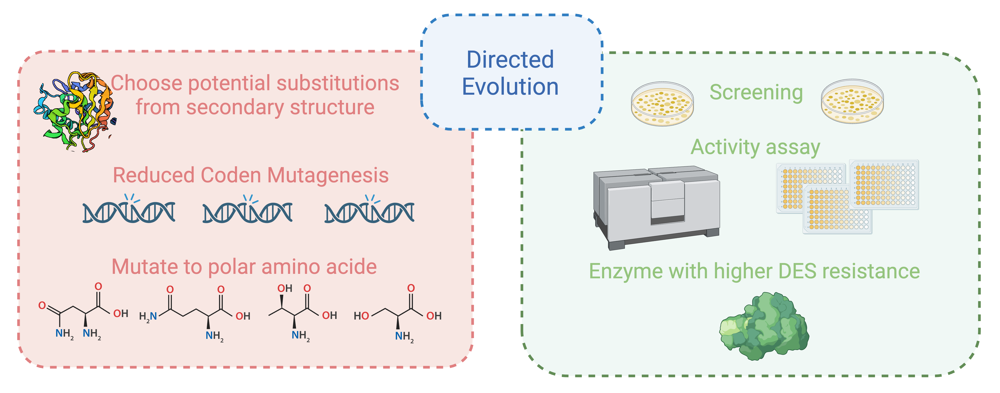
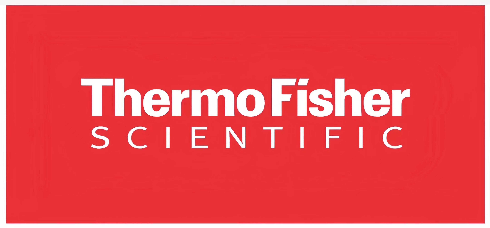

<!DOCTYPE html>
<html lang="en">

<head>
    <meta charset="UTF-8">
    <meta http-equiv="X-UA-Compatible" content="IE=edge">
    <meta name="viewport" content="width=device-width, initial-scale=1.0">
    <title>HOME</title>
    <link href="./idec-css/member.css" rel="stylesheet" />
    <link href="./idec-css/reset123.css" rel="stylesheet" />
    <link href="./idec-css/home.css" rel="stylesheet" />
    <link rel="stylesheet" href="./swiper/swiper-bundle.min.css">
</head>

<body>
    <header>
        

            

                

                    
                

                

                    

                        <ul class="menu-list "><a href="home.html">HOME</a></ul>
                        <ul class="menu-list "><a href="#">TEAM <i class="fa fa-angle-down" aria-hidden="true"></i></a>
                            <li><a href="member.html">MEMBERS</a></li>
                            <li><a href="attributions.html">ATTRIBUTIONS</a></li>
                        </ul>
                        <ul class="menu-list "><a href="#">PROJECT <i class="fa fa-angle-down"
                                    aria-hidden="true"></i></a>
                            <li><a href="background.html">BACKGROUND</a></li>
                            <li><a href="design.html">DESIGN</a></li>
                            <li><a href="Results.html">RESULTS</a></li>
                            <li><a href="Report.html">REPORT</a></li>
                            
                            <li><a href="supplement.html">SUPPLEMENT</a></li>
                            <li><a href="poster.html">POSTER</a></li>
                        </ul>
                        <ul class="menu-list "><a href="#">DOCUMENTATION <i class="fa fa-angle-down"
                                    aria-hidden="true"></i></a>
                            <li><a href="experiments.html">EXPERIMENTS</a></li>
                            <li><a href="safety.html">SAFETY</a></li>
                            <li><a href="protocol.html">PROTOCOL</a></li>
                        </ul>
                    

                

            

        

    </header>
    
    

        

        

        

            

                

                    

                    

                    <h3 class="pph">
                        Enzymes face the challenge of inhibited activity in deep eutectic solvents. So, we used directed
                        evolutionary approach to improve enzyme resistance in deep eutectic solvents.
                    </h3>
                    

                

                

                    <h3 class="pph">
                        Directed evolution stands as a seminal technology for generating novel protein functionalities,
                        a cornerstone in biocatalysis, metabolic engineering, and synthetic biology. Nowadays, more and
                        more directed evolution strategies are developed to design various enzyme properties.
                    </h3>
                

            

            

                

                    <h1
                        style="text-align: center;font-size: 5.5rem;line-height: 1.2;color: #0F5132;font-family: CROSS;">
                        What we did?</h1>
                

                
            

              
            

                

                

                <h3 class="pph">We developed an efffective directed evolution called Corner Engineering to improve
                    enzyme resistance. Molecular dynamic simulation was applied to illuminates the enzyme-DES
                    interaction patterns and fosters the rational design of more DES-resistant enzymes.</h3>
                

                    
                <!---->
            

        

    

    

    <footer style="overflow:hidden">
        

            

                <h1 style="color: #0F5132;margin-top: 30px;">NNU-IDEC 2023</h1>
                

                

            

            

                

                    MAIN SPONSORS

                

                    

                    

                    

                

                

                    LOGISTICS SPONSORS

                

                    

                    

                    

                    

                

                

                    

                    

                    

                    

                

            

        

        

            @ 2023-NNU CHINA

        

    </footer>
</body>

</html>
